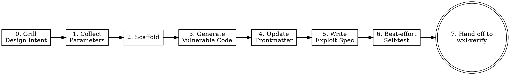

Create a new wxl challenge — from parameter collection through scaffolding, vulnerable code generation, exploit-spec authoring, and a best-effort self-test — then hand off to the `wxl-verify` skill for the release-blocking gate and auto-fix loop. This skill is host-agent-neutral: it depends only on tools shared across Claude Code, Codex CLI, and Gemini CLI (`Bash`, `Read`, `Write`, `Edit`, `Glob`, `Grep`, `WebFetch`), and asks the user questions through plain-text question blocks.

**Input**: The argument after the trigger is an optional free-text description of the challenge to create. Examples:

- (no arguments — will ask everything interactively)
- `建一個 flask 的 SQLi 題目叫 login-bypass`
- `name: xss-form, backend: fastapi, vuln: reflected XSS, difficulty: medium`

## Overview

`wxl-create` owns the **Create** verb only. It scaffolds one new challenge, generates a real exploitable vulnerability, writes an e2e exploit spec, optionally self-tests it, and then hands the challenge to `wxl-verify` for the L1–L3 gate. It never mutates existing challenges (that is `wxl-mutate`) and never runs the L4 blind cross-check (that is `wxl-crosscheck`, maintainer-only).

The skill is invoked when the user types the create trigger, says "create challenge / new challenge / 出題 / 建立題目", or describes a challenge to author.

## Workflow



### Step 0: Grill the challenge design to convergence

- **What**: Before collecting parameters, run a design-convergence interview that applies the `grilling` technique **inline as prose** (technique origin: the `grilling` skill at `.agents/skills/grilling/`). Do NOT dispatch that skill — the method is inlined here so the flow stays host-agent-neutral across Claude Code, Codex CLI, and Gemini CLI. The goal is to converge the user's *design intent* until the generated vulnerability code can hit it precisely, before any file is touched.
- **How**:
  1. **Ask one question at a time.** Emit a single plain-text question, include your recommended answer, and wait for the user's reply before asking the next. Batching multiple questions at once is bewildering — never do it.
  2. **Look up facts, ask only decisions.** Anything resolvable from the environment — whether `docs/challenge/<slug>/` already exists, whether the canonical reference `docs/challenge/door-is-open/src/app.py` is readable, which extra packages a vuln class needs — SHALL be resolved by inspecting the filesystem or tools rather than asked. Reserve questions for genuine design decisions that are the user's to make.
  3. **Grill the design, not just the fields.** Walk the design decision tree, resolving dependencies between decisions one by one, covering at minimum:
     - **Vulnerability realism & non-obviousness** — is it a real, exploitable, non-trivial bug (never a bare `eval(user_input)` / `os.system(input())`)?
     - **Expected exploitation path** — what exact steps take a solver from the HTML UI to `/flag.txt`, and does that path actually hold end-to-end?
     - **Difficulty calibration** — does the intended difficulty match the scenario and the complexity of the exploitation path?
     - **Misdirection / red herrings** — are decoys wanted, and how strong? (This depends on the difficulty decision.)
     - **Flag placement plausibility** — is reading the flag from `/flag.txt` reachable only through the intended vulnerability, not by an unintended shortcut?
  4. **Do not act until shared understanding.** SHALL NOT run `pnpm create:challenge`, generate code, or write any file until the user confirms the design is agreed.
  5. **Fast-pass when already clear.** If the initial prompt already describes a precise, generatable design, summarize it back and ask for a single confirmation instead of grilling every dimension.
  6. **Feed conclusions into Step 1.** Treat every design point settled here — especially `slug`, `backend`, `vuln`, `description`, `difficulty` — as an already-provided parameter, so Step 1 skips those and asks only for what Step 0 left open.
- **Verification**: The user has confirmed a shared design; the settled parameters are carried into Step 1; no file was created or modified during Step 0.

### Step 1: Collect parameters

- **What**: Collect the challenge parameters, extracting any already supplied in the initial message or settled during Step 0, and asking only for the rest.
- **How**: Scan the initial argument first. For each missing parameter, emit a plain-text question block and wait for the user's next message. Group questions into rounds and skip a whole round when all its parameters are already known.

Parameters:

| Parameter | Key | Required | Default |
|-----------|-----|----------|---------|
| Challenge name (slug) | `slug` | Yes | — |
| Backend type | `backend` | Yes | — |
| Vulnerability type | `vuln` | Yes | — |
| Challenge description | `description` | Yes | — |
| Difficulty | `difficulty` | Yes | — |
| Flag | `flag` | No | `FLAG{<slug>_<random8hex>}` |
| Title | `title` | No | Slug → Title Case |

Plain-text question block shape (one block per round):

```
📋 Round <N> — <topic>:
  1) <option-A>
  2) <option-B>
  3) <option-C>
Please reply with a number, the option name, or a custom value.
```

- **Round 1 (required)**: slug (validate kebab-case `/^[a-z0-9]([a-z0-9-]*[a-z0-9])?$/`; re-ask if invalid), backend (`1) flask  2) fastapi  3) php`), vuln (free text: SQLi, XSS, SSRF, LFI, RCE, XXE, SSTI, IDOR, …).
- **Round 2 (content)**: description (scenario narrative used to generate the code), difficulty (`1) easy  2) medium  3) hard`).
- **Round 3 (optional with defaults)**: flag (offer the default format), title (offer slug→Title Case).

After collecting, show a summary and a plain-text confirmation block (`1) 確認  2) 修改參數`). Wait for the reply; on `2`, re-ask the specific parameter.

- **Verification**: All required parameters resolved; `slug` matches the kebab-case regex; the user confirmed with `1`.

### Step 2: Scaffold

- **What**: Create the challenge skeleton via the existing scaffold CLI (never duplicate scaffold logic in prose).
- **How**: Run via Bash:

  ```bash
  pnpm create:challenge --name "<slug>" --backend "<backend>" --difficulty "<difficulty>" --flag "<flag>" --title "<title>"
  ```

  Omit `--flag` to let the script auto-generate. On exit code 1 (collision), show the error and ask (plain-text block) to choose a different name or cancel; on `1`, re-ask the slug and re-run; on `2`, stop.
- **Verification**: Exit code 0; the challenge directory exists under `docs/challenge/<slug>/`.

### Step 3: Generate vulnerable application code

- **What**: Rewrite the scaffolded skeleton with real, exploitable vulnerability code matching `vuln` and `description`.
- **How**:
  1. **Consult the capability registry (if applicable).** Match `vuln` against the registry table below. If a trigger regex matches, read the mapped reference document first and let its recognition heuristics shape the vulnerability.

     | Trigger regex | Reference file |
     |---------------|----------------|
     | `idor\|jwt\|path.?traversal\|access.?control\|broken.?access` (case-insensitive) | `reference/a01-access-control.md` |

     New capability packs extend this behavior by appending a row — no other workflow change required.
  2. **Read the skeleton** (`docs/challenge/<slug>/src/app.py` for Flask/FastAPI, or `docs/challenge/<slug>/src/index.php` for PHP).
  3. **Read the canonical reference** — the literal directory `docs/challenge/door-is-open/` (not the slug being created) — as the ONLY code-style reference. Read `docs/challenge/door-is-open/src/app.py`. If it is unreadable, halt with a deterministic error containing the literal path `docs/challenge/door-is-open/` and leave no partial files.
  4. **Write** the vulnerable code (Write tool, overwriting the skeleton). It SHALL follow the reference structure; read the flag via `open("/flag.txt").read().strip()` (Python) or `file_get_contents('/flag.txt')` (PHP); contain a real, exploitable, non-trivial vulnerability (no bare `eval(user_input)` / `os.system(input())`); include HTML UI for realistic attack surface; mark the vulnerable line with `# Vulnerability: <brief explanation>`.
  5. Note any extra packages the vuln needs (e.g. `sqlite3`) for Step 4.

  Backend notes — Flask: `from flask import Flask, request, Response`, `@app.route()`. FastAPI: `from fastapi import FastAPI`, `from fastapi.responses import HTMLResponse`, `@app.get()` / `@app.post()`. PHP: `<?php`, `$_GET` / `$_POST`, `file_get_contents('/flag.txt')`.
- **Verification**: The app file contains a `# Vulnerability:` marker and a clear exploitation path to the flag; no hardcoded `localhost` / `127.0.0.1` / `0.0.0.0` (the app runs in WASM).

### Step 4: Update frontmatter and description

- **What**: Fill `index.md` frontmatter and body with the collected metadata.
- **How**: Read `docs/challenge/<slug>/index.md` and Edit it to set `description` (1–2 sentences), `tags` (vuln keywords + backend, e.g. `[sql, injection, flask, sqlite]`), `source_visible: false`, and `packages` (extra Python packages, else `[]`). Replace `TODO: Write challenge description here.` in the body with a 1–2 sentence scenario. Do NOT modify `title`, `layout`, `difficulty`, `category`, `backend`, `app`, `date` (set by scaffold).
- **Verification**: `index.md` frontmatter contains `description`, `tags`, `source_visible: false`; the body no longer contains the TODO placeholder.

### Step 5: Write the Playwright exploit spec

- **What**: Render `tests/challenges/<slug>.spec.ts` from the template.
- **How**: Read `.agent/skills/wxl-create/templates/exploit-spec.ts.tmpl`. If it does not exist, halt, emit `template not found: .agent/skills/wxl-create/templates/exploit-spec.ts.tmpl`, and delete any partial spec so the repo stays clean. Substitute:

  | Placeholder | Source |
  |-------------|--------|
  | `{{SLUG}}` | the kebab-case slug |
  | `{{BASE_URL}}` | `http://localhost:5173/challenge/<slug>/` |
  | `{{EXPLOIT_PATH}}` | the URL path the exploit fetches (e.g. `/download?id=1`) |
  | `{{EXPLOIT_PAYLOAD}}` | the request body/query payload (URL-encoded form, or `''` for plain GET) |
  | `{{FLAG_REGEX}}` | `^(FLAG\|CTF)\\{[^}]+\\}$` |

  Write the rendered spec via the Write tool and confirm it exists.
- **Verification**: `tests/challenges/<slug>.spec.ts` exists, imports `@playwright/test`, and asserts the response body matches `{{FLAG_REGEX}}`.

### Step 6: Best-effort self-test via chrome-devtools-mcp

- **What**: Best-effort confirm the vuln is exploitable through a real Chromium instance. **Never halt** on failure here — degrade and continue to Step 7.
- **How**: If `chrome-devtools-mcp` is unavailable, emit `MCP unavailable; please run pnpm challenge:verify <slug> manually after dev server is up.` and continue. If `pnpm docs:dev` is not reachable at `http://localhost:5173`, emit `dev server not running; please start pnpm docs:dev and run pnpm challenge:verify <slug> manually.` and continue. Otherwise make up to three attempts (navigate to the challenge, wait for the Service Worker, send the exploit, match `FLAG_REGEX`); a failed attempt MAY revise `docs/challenge/<slug>/src/<app>` once (max two revisions, three attempts total). After three failures, emit `self-test inconclusive after 3 attempts; please run pnpm challenge:verify <slug> manually and inspect.` and continue. Do NOT touch the spec file, frontmatter, or `flag.txt` in this step.
- **Verification**: Either a "self-test passed" message, or one of the degrade messages above — the workflow always continues.

### Step 7: Hand off to wxl-verify

- **What**: Run the release-blocking gate and, on any non-clean result, enter the shared auto-fix loop.
- **How**: Run `pnpm challenge:verify <slug>` (without `--blind`) and hand the result **entirely** to the `wxl-verify` skill's Step 1 / Step 2 branching — do NOT restate the exit-code logic here. `wxl-verify` owns the single branch decision: a clean gate → done; exit 1 **or** exit 0 with L1/L2 warnings in stdout (e.g. flag-format mismatch, hardcoded localhost) → its auto-fix loop (plain-text confirmation, `max_fix_attempts` from `.wxl-verify/config.yaml`). When the gate is clean, emit a completion summary, for example:

  ```
  ✓ Challenge "<slug>" 建立完成！
    docs/challenge/<slug>/index.md
    docs/challenge/<slug>/src/<app-file>
    docs/challenge/<slug>/src/flag.txt
    tests/challenges/<slug>.spec.ts
  可用 pnpm docs:dev 預覽，或繼續建立下一個題目。
  ```

  The Create flow SHALL NOT run `--blind`; L4 is reserved for `wxl-crosscheck`.
- **Verification**: `pnpm challenge:verify <slug>` ends clean (directly or after the wxl-verify fix loop), or the loop stops within the configured limit with remaining issues surfaced.

## Anti-patterns

- ❌ **Generating a trivially obvious vuln** (`eval(user_input)`, `os.system(input())`).
  - ✅ Write a realistic, non-trivial vuln with an HTML attack surface and a clear path to `/flag.txt`.
  - **Why**: Trivial vulns are not solvable-as-intended challenges and fail L2/L3.
- ❌ **Skipping the canonical reference** and generating code from scratch.
  - ✅ Always read `docs/challenge/door-is-open/src/app.py` first; halt (with the literal path) if it is unreadable. Never fall back to `.archive/`, another `docs/challenge/` dir, a user path, or a globbed "next demo".
  - **Why**: The canonical reference is the single style contract; drift breaks consistency and is flagged by `/spectra-audit`.
- ❌ **Hardcoding `localhost` / `127.0.0.1` in app code.**
  - ✅ The app runs in WASM, not a real server — never hardcode a host.
  - **Why**: L1/L2 flag hardcoded hosts.
- ❌ **Running `pnpm challenge:verify --blind` from Create.**
  - ✅ Create hands off to `wxl-verify` (L1–L3) only; L4 is `wxl-crosscheck`, maintainer-only.

## Verification

Acceptance criteria for the Create flow (all use cross-agent tools):

- Files exist: `docs/challenge/<slug>/index.md`, `docs/challenge/<slug>/src/<app>`, `docs/challenge/<slug>/src/flag.txt`, `tests/challenges/<slug>.spec.ts`.
- `pnpm challenge:verify <slug>` exits 0 (Requirement "Skill triggers challenge:verify automatically at the end of the Create flow", via `wxl-verify`).
- Host-agent-neutral prose (Requirement inherited from `authoring-skill-pattern`):

  ```bash
  git grep -nE '<FORBIDDEN-PATTERN>' .agent/skills/wxl-create/
  # <FORBIDDEN-PATTERN> = the forbidden-primitive regex from openspec/specs/authoring-skill-pattern/spec.md; exit code 1 = pass
  ```
- The registry table in `SKILL.md` and `SKILL.zhTW.md` contain the same rows (Requirement "Skill consumes capability-specific reference documents via a registry table").
