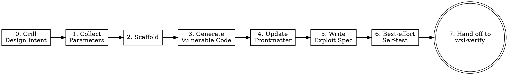

> 本檔為 `.agent/skills/wxl-create/SKILL.md` 的台灣繁體中文鏡像。以英文 canonical 為準；兩份的 registry table 必須逐列一致。

建立一個新的 wxl 題目 —— 從參數收集、scaffold、生成漏洞碼、撰寫 exploit spec 到 best-effort self-test，最後交棒給 `wxl-verify` skill 跑 release-blocking gate 與 auto-fix loop。本 skill 為 host-agent-neutral：只依賴三家 host（Claude Code、Codex CLI、Gemini CLI）共有的工具（`Bash`、`Read`、`Write`、`Edit`、`Glob`、`Grep`、`WebFetch`），並以純文字問題區塊向使用者提問。

**Input**：觸發詞後面的引數是選填的題目描述，例如：

- （無引數 —— 全程互動式提問）
- `建一個 flask 的 SQLi 題目叫 login-bypass`
- `name: xss-form, backend: fastapi, vuln: reflected XSS, difficulty: medium`

## Overview

`wxl-create` 只負責 **Create** verb：scaffold 一個新題目、生成真實可利用的漏洞、寫 e2e exploit spec、選擇性 self-test，然後把題目交給 `wxl-verify` 跑 L1–L3 gate。它不變更既有題目（那是 `wxl-mutate`），也不跑 L4 blind cross-check（那是 `wxl-crosscheck`，maintainer-only）。

## Workflow



### Step 0：Grill 收斂題目設計

- **What**：在收集參數之前，先跑一段設計收斂訪談，**以內嵌 prose 的形式**採用 `grilling` 技法（技法來源：`.agents/skills/grilling/` 的 `grilling` skill）。**不要 dispatch 那個 skill** —— 技法內嵌於此，讓流程在 Claude Code／Codex CLI／Gemini CLI 三家都維持 host-agent-neutral。目標是把使用者的*設計意圖*收斂到「生成的漏洞碼能精準命中」的程度，且在此之前不動任何檔案。
- **How**：
  1. **一次只問一題。** 發出單一純文字問題、附上你的建議答案，等使用者回覆後再問下一題。一次問多題令人困惑 —— 絕不這麼做。
  2. **事實自己查，只問決策。** 凡是能從環境查到的 —— `docs/challenge/<slug>/` 是否已存在、canonical reference `docs/challenge/door-is-open/src/app.py` 是否可讀、某類漏洞需要哪些額外套件 —— SHALL 以檢視檔案系統或工具解決，而非拿去問使用者。只把真正屬於使用者的設計決策當成問題。
  3. **拷問設計，而不只是欄位。** 逐一走設計決策樹、解出決策間相依，至少涵蓋：
     - **漏洞真實性與非顯而易見性** —— 是否為真實、可利用、非顯而易見的漏洞（絕非裸 `eval(user_input)` / `os.system(input())`）？
     - **預期攻擊路徑** —— 解題者從 HTML UI 到 `/flag.txt` 的確切步驟為何？這條路徑端到端真的成立嗎？
     - **難度校準** —— 預期難度是否與情境及攻擊路徑複雜度相符？
     - **誤導／紅鯡** —— 是否需要誘餌、強度多少？（此項取決於難度決策。）
     - **flag 位置合理性** —— 從 `/flag.txt` 讀 flag 是否只能經由預期漏洞達成，而非被非預期的捷徑繞過？
  4. **達成共識前不動手。** 在使用者確認設計已定案前，SHALL NOT 執行 `pnpm create:challenge`、生成程式碼或寫任何檔案。
  5. **設計已清楚時快速通過。** 若初始訊息已描述出精準、可生成的設計，就複述設計並請使用者一次確認，而非逐維度拷問。
  6. **結論回饋 Step 1。** 把此處定案的每個設計點 —— 尤其 `slug`、`backend`、`vuln`、`description`、`difficulty` —— 視為已提供的參數，讓 Step 1 跳過它們、只補問 Step 0 未定案的欄位。
- **Verification**：使用者已確認共識設計；定案參數帶入 Step 1；Step 0 期間未建立或修改任何檔案。

### Step 1：收集參數

- **What**：收集題目參數，先抓出初始訊息已提供或 Step 0 已定案的，只針對缺的提問。
- **How**：先掃描初始引數。缺的參數每輪發一個純文字問題區塊並等使用者下一則訊息；整輪都已知就跳過該輪。

要蒐集的參數：

| 參數 | Key | 必填 | 預設 |
|------|-----|------|------|
| 題目名（slug） | `slug` | 是 | — |
| Backend | `backend` | 是 | — |
| 漏洞類型 | `vuln` | 是 | — |
| 題目描述 | `description` | 是 | — |
| 難度 | `difficulty` | 是 | — |
| Flag | `flag` | 否 | `FLAG{<slug>_<random8hex>}` |
| Title | `title` | 否 | slug → Title Case |

純文字問題區塊格式（每輪一塊）：

```
📋 Round <N> — <topic>:
  1) <option-A>
  2) <option-B>
  3) <option-C>
Please reply with a number, the option name, or a custom value.
```

- **Round 1（必填）**：slug（驗證 kebab-case `/^[a-z0-9]([a-z0-9-]*[a-z0-9])?$/`，不合法就重問）、backend（`1) flask  2) fastapi  3) php`）、vuln（自由文字：SQLi、XSS、SSRF、LFI、RCE、XXE、SSTI、IDOR…）。
- **Round 2（內容）**：description（生成程式碼用的情境敘述）、difficulty（`1) easy  2) medium  3) hard`）。
- **Round 3（選填含預設）**：flag（提供預設格式）、title（提供 slug→Title Case）。

收集完顯示摘要與純文字確認區塊（`1) 確認  2) 修改參數`），等回覆；回 `2` 就重問該參數。

### Step 2：Scaffold

- **What**：透過既有 scaffold CLI 建立題目骨架（prose 不重複 scaffold 邏輯）。
- **How**：以 Bash 執行 `pnpm create:challenge --name "<slug>" --backend "<backend>" --difficulty "<difficulty>" --flag "<flag>" --title "<title>"`。要自動產生 flag 就省略 `--flag`。exit code 1（名稱衝突）時顯示錯誤並以純文字區塊問「換名稱 / 取消」；`1` 重問 slug 並重跑，`2` 停止。

### Step 3：生成漏洞應用程式碼

- **What**：把 scaffold 骨架改寫成符合 `vuln` 與 `description` 的真實可利用漏洞碼。
- **How**：
  1. **查 capability registry（若適用）**：以 `vuln` 比對下表；命中 trigger regex 就先讀對應 reference 文件，讓其 recognition heuristics 形塑漏洞。

     | Trigger regex | Reference file |
     |---------------|----------------|
     | `idor\|jwt\|path.?traversal\|access.?control\|broken.?access`（不分大小寫） | `reference/a01-access-control.md` |

     新增 capability pack 只需在此表加一列，不需改動其他流程。
  2. **讀骨架**（Flask/FastAPI 為 `docs/challenge/<slug>/src/app.py`，PHP 為 `docs/challenge/<slug>/src/index.php`）。
  3. **讀 canonical reference** —— 字面目錄 `docs/challenge/door-is-open/`（不是正在建立的 slug）—— 為唯一程式碼風格參考，讀 `docs/challenge/door-is-open/src/app.py`。若不可讀，halt 並丟含字面路徑 `docs/challenge/door-is-open/` 的錯誤，且不留半成品。
  4. **寫入**漏洞碼（Write，覆蓋骨架）：沿用 reference 結構；以 `open("/flag.txt").read().strip()`（Python）或 `file_get_contents('/flag.txt')`（PHP）讀 flag；含真實、可利用、非顯而易見的漏洞（禁止裸 `eval(user_input)` / `os.system(input())`）；含 HTML UI 攻擊面；漏洞那行標 `# Vulnerability: <brief explanation>`。
  5. 記下漏洞需要的額外套件（如 `sqlite3`）供 Step 4。

  Backend 提示 —— Flask：`from flask import Flask, request, Response`、`@app.route()`。FastAPI：`from fastapi import FastAPI`、`from fastapi.responses import HTMLResponse`、`@app.get()` / `@app.post()`。PHP：`<?php`、`$_GET`/`$_POST`、`file_get_contents('/flag.txt')`。

### Step 4：更新 frontmatter 與描述

- **What**：以收集到的 metadata 填 `index.md` 的 frontmatter 與 body。
- **How**：讀 `docs/challenge/<slug>/index.md` 並 Edit，設 `description`（1–2 句）、`tags`（漏洞關鍵字＋backend，如 `[sql, injection, flask, sqlite]`）、`source_visible: false`、`packages`（額外 Python 套件，否則 `[]`）。把 body 的 `TODO: Write challenge description here.` 換成 1–2 句情境。**勿改** `title`、`layout`、`difficulty`、`category`、`backend`、`app`、`date`（scaffold 已設）。

### Step 5：寫 Playwright exploit spec

- **What**：從範本 render 出 `tests/challenges/<slug>.spec.ts`。
- **How**：讀 `.agent/skills/wxl-create/templates/exploit-spec.ts.tmpl`。若不存在，halt 並丟 `template not found: .agent/skills/wxl-create/templates/exploit-spec.ts.tmpl`，刪掉任何半成品 spec。替換 `{{SLUG}}`、`{{BASE_URL}}`（`http://localhost:5173/challenge/<slug>/`）、`{{EXPLOIT_PATH}}`、`{{EXPLOIT_PAYLOAD}}`、`{{FLAG_REGEX}}`（`^(FLAG\|CTF)\\{[^}]+\\}$`）。以 Write 寫出並確認存在。

### Step 6：best-effort self-test（chrome-devtools-mcp）

- **What**：以真實 Chromium best-effort 確認漏洞可利用。此步**永不 halt** —— 失敗就 degrade 並續 Step 7。
- **How**：`chrome-devtools-mcp` 不可用 → 印 `MCP unavailable; please run pnpm challenge:verify <slug> manually after dev server is up.` 並續行。`pnpm docs:dev` 在 `http://localhost:5173` 不可達 → 印 `dev server not running; please start pnpm docs:dev and run pnpm challenge:verify <slug> manually.` 並續行。否則最多三次嘗試（navigate、等 Service Worker、送 exploit、比對 `FLAG_REGEX`）；失敗一次可改一次 `docs/challenge/<slug>/src/<app>`（最多兩次修改、三次嘗試）。三次都失敗 → 印 `self-test inconclusive after 3 attempts; please run pnpm challenge:verify <slug> manually and inspect.` 並續行。此步勿動 spec、frontmatter、`flag.txt`。

### Step 7：交棒 wxl-verify

- **What**：跑 release-blocking gate，任何非 clean 結果都進共用 auto-fix loop。
- **How**：跑 `pnpm challenge:verify <slug>`（不帶 `--blind`），並把結果**完全交給** `wxl-verify` skill 的 Step 1／Step 2 分支 —— 此處不重述 exit-code 邏輯。由 `wxl-verify` 單一擁有分支決策：gate clean → 收工；exit 1 **或** exit 0 但 stdout 有 L1/L2 warning（如 flag 格式不符、寫死 localhost）→ 進其 auto-fix loop（純文字確認、`max_fix_attempts` 讀 `.wxl-verify/config.yaml`）。gate clean 時印完成摘要，例如：

  ```
  ✓ Challenge "<slug>" 建立完成！
    docs/challenge/<slug>/index.md
    docs/challenge/<slug>/src/<app-file>
    docs/challenge/<slug>/src/flag.txt
    tests/challenges/<slug>.spec.ts
  可用 pnpm docs:dev 預覽，或繼續建立下一個題目。
  ```

  Create 流程**不得**跑 `--blind`；L4 保留給 `wxl-crosscheck`。

## Anti-patterns

- ❌ **生成顯而易見的漏洞**（`eval(user_input)`、`os.system(input())`）。
  - ✅ 寫真實、非顯而易見、含 HTML 攻擊面、到 `/flag.txt` 有清楚路徑的漏洞。
- ❌ **跳過 canonical reference** 憑空生成。
  - ✅ 一律先讀 `docs/challenge/door-is-open/src/app.py`；不可讀就 halt（含字面路徑）。不 fallback 到 `.archive/`、其他 `docs/challenge/` 目錄、使用者路徑或 glob 出的 demo。
- ❌ **在 app 碼寫死 `localhost` / `127.0.0.1`。**
  - ✅ app 跑在 WASM，不是真 server，勿寫死 host。
- ❌ **從 Create 跑 `--blind`。**
  - ✅ Create 只交棒 `wxl-verify`（L1–L3）；L4 是 `wxl-crosscheck`，maintainer-only。

## Verification

- 檔案存在：`docs/challenge/<slug>/index.md`、`docs/challenge/<slug>/src/<app>`、`docs/challenge/<slug>/src/flag.txt`、`tests/challenges/<slug>.spec.ts`。
- `pnpm challenge:verify <slug>` exit 0（經 `wxl-verify`）。
- host-neutral：`git grep -nE '<FORBIDDEN-PATTERN>' .agent/skills/wxl-create/` exit code 1（`<FORBIDDEN-PATTERN>` 為 `openspec/specs/authoring-skill-pattern/spec.md` 列舉的禁字 regex）。
- `SKILL.md` 與 `SKILL.zhTW.md` 的 registry table 逐列一致。
