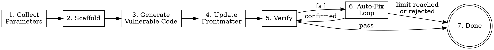

Create a new wxl challenge — from parameter collection through scaffolding, vulnerable code generation, metadata update, and validation with auto-fix. This skill is host-agent-neutral: it depends only on tools shared across Claude Code, Codex CLI, and Gemini CLI (`Bash`, `Read`, `Write`, `Edit`, `Glob`, `Grep`, `WebFetch`), and asks the user questions through plain-text question blocks.

**Input**: The argument after `/wxl-creator` is an optional free-text description of the challenge to create. Examples:

- `/wxl-creator` (no arguments — will ask everything interactively)
- `/wxl-creator 建一個 flask 的 SQLi 題目叫 login-bypass`
- `/wxl-creator name: xss-form, backend: fastapi, vuln: reflected XSS, difficulty: medium`

**Workflow overview:**



---

**Steps**

1. **Collect parameters**

   First, scan the user's initial message (the argument after `/wxl-creator`) and extract any parameters already provided. Parameters to collect:

   | Parameter | Key | Required | Default |
   |-----------|-----|----------|---------|
   | Challenge name (slug) | `slug` | Yes | — |
   | Backend type | `backend` | Yes | — |
   | Vulnerability type | `vuln` | Yes | — |
   | Challenge description | `description` | Yes | — |
   | Difficulty | `difficulty` | Yes | — |
   | Flag | `flag` | No | `FLAG{<slug>_<random8hex>}` |
   | Title | `title` | No | Slug → Title Case |

   For each parameter NOT already provided, emit a plain-text question block and wait for the user's next message. Group questions into rounds — skip entire rounds if all parameters in that round are already extracted.

   **Plain-text question block shape** (one block per round):

   ```
   📋 Round <N> — <topic>:
     1) <option-A>
     2) <option-B>
     3) <option-C>
   Please reply with a number, the option name, or a custom value.
   ```

   **Round 1 (required):**
   - slug: Ask for the challenge name (free-text). Validate: must be kebab-case (`/^[a-z0-9]([a-z0-9-]*[a-z0-9])?$/`). If invalid, explain and re-ask.
   - backend: Plain-text question block with options `1) flask  2) fastapi  3) php`.
   - vuln: Ask for vulnerability type as free text (e.g., SQLi, XSS, SSRF, LFI, RCE, XXE, SSTI, IDOR, etc.).

   **Round 2 (content):**
   - description: Ask for a scenario narrative describing the challenge. This is what you will use to generate the vulnerable code.
   - difficulty: Plain-text question block with options `1) easy  2) medium  3) hard`.

   **Round 3 (optional with defaults):**
   - flag: Show the default format `FLAG{<slug>_<random8hex>}` and ask if the user wants to customize. If the user accepts, auto-generate later.
   - title: Show the default (slug converted to Title Case) and ask if the user wants to customize.

   After collecting all parameters, display a summary:

   ```
   📋 Challenge 參數確認：
     Name:       <slug>
     Backend:    <backend>
     Vuln Type:  <vuln>
     Difficulty: <difficulty>
     Flag:       <flag or "auto-generate">
     Title:      <title>
     Description: <description>
   ```

   Then emit a plain-text confirmation block:

   ```
   📋 確認建立？
     1) 確認
     2) 修改參數
   Please reply with `1` (confirm) or `2` (modify).
   ```

   Wait for the user's next message. If the user replies `2` (or "modify"), re-ask the specific parameter.

2. **Scaffold**

   Run the scaffold command via Bash:

   ```bash
   pnpm create:challenge --name "<slug>" --backend "<backend>" --difficulty "<difficulty>" --flag "<flag>" --title "<title>"
   ```

   If `flag` was set to auto-generate, omit the `--flag` argument (the script generates one automatically).

   **If exit code is 0**: Report success and proceed to step 3.

   **If exit code is 1 (collision)**: Display the error message. Emit a plain-text question block:

   ```
   📋 名稱衝突：
     1) 選擇不同名稱
     2) 取消
   Please reply with `1` or `2`.
   ```

   Wait for the user's reply. On `1`, re-ask for the slug and re-run scaffold. On `2`, stop the workflow.

   **If exit code is 1 (other error)**: Display the error and stop.

3. **Generate vulnerable application code**

   This is the core step. You SHALL read the scaffold skeleton and rewrite it with real, exploitable vulnerability code.

   **3.0. Consult capability-specific reference (if applicable).** Before reading the skeleton, match the collected `vuln` against the capability registry table below. If it matches a trigger regex, read the mapped `reference/<capability>.md` first and let its recognition heuristics and per-primitive fix hints shape the vulnerability you generate.

   | Trigger regex | Reference file |
   |---------------|----------------|
   | `idor\|jwt\|path.?traversal\|access.?control\|broken.?access` (case-insensitive) | `reference/a01-access-control.md` |

   New capability packs extend this behavior by appending a row to this table — no other change to this workflow is required.

   a. **Read the skeleton file** using the Read tool:
      - Flask/FastAPI: `docs/challenge/<slug>/src/app.py`
      - PHP: `docs/challenge/<slug>/src/index.php`

   b. **Read the canonical reference — the literal directory `docs/challenge/door-is-open/` (not the slug being created) — as the ONLY reference** for code style and structure. You SHALL NOT add additional reference paths to this list.
      - `docs/challenge/door-is-open/src/app.py`

   c. **Write the vulnerable code** using the Write tool to overwrite the skeleton. The generated code SHALL:
      - Follow the same structure as the reference (docstring, imports, setup, HTML template, routes)
      - Read the flag from `/flag.txt` using `open("/flag.txt").read().strip()`
      - Contain a **real, exploitable** vulnerability matching the specified vuln type
      - NOT be trivially obvious (no bare `eval(user_input)` or `os.system(input())`)
      - Include HTML UI (forms, pages) for realistic attack surface
      - Have a clear exploitation path leading to flag retrieval
      - Include a comment marking the vulnerable line: `# Vulnerability: <brief explanation>`

   d. **Note package dependencies** needed by the vulnerability (e.g., `sqlite3` for SQLi). You will add them to frontmatter in step 4.

   **Backend-specific guidance:**
   - **Flask**: Use `from flask import Flask, request, Response`. Routes with `@app.route()`.
   - **FastAPI**: Use `from fastapi import FastAPI` and `from fastapi.responses import HTMLResponse`. Routes with `@app.get()` / `@app.post()`.
   - **PHP**: Standard PHP with `<?php` opening. Use `$_GET`/`$_POST` for input. Use `file_get_contents('/flag.txt')` for flag.

4. **Update frontmatter and description**

   Read `docs/challenge/<slug>/index.md` using the Read tool. Then use the Edit tool to update:

   a. **Add/update frontmatter fields:**
      - `description`: 1-2 sentence challenge description derived from the collected description
      - `tags`: Array of relevant tags — include vulnerability keywords and backend (e.g., `[sql, injection, flask, sqlite]`)
      - `source_visible: false`
      - `packages`: Array of additional Python packages if the vulnerability requires them (e.g., `[sqlite3]`). Leave as `[]` if none needed.

   b. **Replace the markdown body:** Replace `TODO: Write challenge description here.` with a brief challenge description (1-2 sentences describing the scenario and player's goal).

   **Do NOT modify**: `title`, `layout`, `difficulty`, `category`, `backend`, `app`, `date` — these were set correctly by the scaffold.

5. **Write Playwright exploit spec from template**

   Read `.agent/skills/wxl-creator/templates/exploit-spec.ts.tmpl` using the Read tool. If the template file does not exist, **halt** the workflow, emit the message `template not found: .agent/skills/wxl-creator/templates/exploit-spec.ts.tmpl`, and **delete any intermediate files** you may have already written (Playwright spec) so the repo is left clean.

   Substitute the five mustache placeholders with values derived from the parameters you collected and the vulnerable code you generated:

   | Placeholder | Source |
   |-------------|--------|
   | `{{SLUG}}` | the kebab-case slug |
   | `{{BASE_URL}}` | `http://localhost:5173/challenge/<slug>/` |
   | `{{EXPLOIT_PATH}}` | the URL path the exploit fetches (e.g., `/download?id=1`) — derive from the vuln you implemented |
   | `{{EXPLOIT_PAYLOAD}}` | the request body or query payload (URL-encoded form, or `''` for plain GET) |
   | `{{FLAG_REGEX}}` | `^(FLAG\|CTF)\\{[^}]+\\}$` (escape `|` as `\|` inside the regex literal) |

   Write the rendered spec to `tests/challenges/<slug>.spec.ts` using the Write tool. Confirm the file exists before continuing.

6. **Self-test the exploit via chrome-devtools-mcp (best-effort)**

   This step is **best-effort**. If any precondition fails, **do not halt** the workflow — degrade gracefully and continue to step 7 with a notice.

   a. Check whether `chrome-devtools-mcp` tools are available in the current runtime (try `mcp__plugin_chrome-devtools-mcp_chrome-devtools__list_pages` or equivalent). If the tool is missing, emit `MCP unavailable; please run pnpm challenge:verify <slug> manually after dev server is up.` and skip to step 7.

   b. Check whether `pnpm docs:dev` is reachable at `http://localhost:5173`. If the dev server is not running, emit `dev server not running; please start pnpm docs:dev and run pnpm challenge:verify <slug> manually.` and skip to step 7.

   c. Otherwise, perform up to **three attempts**:
      - Navigate to `http://localhost:5173/challenge/<slug>/`.
      - Wait for the Service Worker to be ready.
      - Send the exploit request (mirroring `{{EXPLOIT_PATH}}` / `{{EXPLOIT_PAYLOAD}}` from the spec).
      - Confirm the response body matches the FLAG_REGEX.

   d. If an attempt fails, you MAY revise `docs/challenge/<slug>/src/<app>` ONCE and retry (max two revisions, three total attempts). After three failed attempts, emit `self-test inconclusive after 3 attempts; please run pnpm challenge:verify <slug> manually and inspect.` and continue to step 7. **Do not touch** the spec file, frontmatter, or `flag.txt` from this step.

7. **Run the Verify gate**

   Run the layered Verify gate via Bash:

   ```bash
   pnpm challenge:verify <slug>
   ```

   `pnpm challenge:verify` orchestrates L1 (frontmatter / structure lint, delegates to the existing `challenge:validate` check), L2 (content analysis + keygen + `wasm-tools validate`, delegates to the existing `challenge:analyze` check), and L3 (Playwright e2e). L4 (blind solve) is **not** auto-triggered — only the maintainer invokes it via `--blind` before a release.

   - **Exit code 0**: Display success — list the layers that passed. Go to step 9 (completion — success).
   - **Exit code 1**: Display the layered output verbatim. Go to step 8 (auto-fix loop).

8. **Auto-fix loop**

   ```dot
   digraph fixloop {
       node [shape=box];
       start [label="Parse layered\nverify output", shape=ellipse];
       check_limit [label="attempts < max?", shape=diamond];
       fix [label="Propose fixes"];
       show_diff [label="Show changes\nto user"];
       confirm [label="User confirms?", shape=diamond];
       apply [label="Apply fixes"];
       revalidate [label="Re-run pnpm\nchallenge:verify"];
       pass [label="All layers pass?", shape=diamond];
       done [label="→ Step 9\n(success)", shape=doublecircle];
       stop_limit [label="→ Step 9\n(with errors)"];
       stop_reject [label="→ Step 9\n(with errors)"];

       start -> check_limit;
       check_limit -> fix [label="yes"];
       check_limit -> stop_limit [label="no"];
       fix -> show_diff;
       show_diff -> confirm;
       confirm -> apply [label="yes"];
       confirm -> stop_reject [label="no"];
       apply -> revalidate;
       revalidate -> pass;
       pass -> done [label="yes"];
       pass -> start [label="no"];
   }
   ```

   **Reading the config:** At the start of this step, read `.wxl-creator/config.yaml` using the Read tool. Parse the YAML to extract `max_fix_attempts`. If the file does not exist or has no such field, use the default value of **10**. Initialize `attempt = 0`.

   **Each iteration:**

   a. Increment `attempt`. If `attempt > max_fix_attempts`, display:

      ```
      已達到自動修正上限（<max> 次）。以下問題需要手動處理：
      - <remaining errors/warnings>
      可在 .wxl-creator/config.yaml 調整 max_fix_attempts。
      ```

      Go to step 9 (completion — with errors).

   b. **Parse** the layered verify output from the previous run. Identify which layer failed (L1 / L2 / L3) and the specific reason; address all issues in a single combined fix.

   c. **Propose fixes** — address ALL identified issues in a single attempt:
      - Missing/invalid frontmatter fields → add or correct them using Edit tool
      - Wrong file type for backend → fix the mismatch
      - Flag format not matching `FLAG{...}` or `CTF{...}` → rewrite flag.txt
      - Hardcoded `localhost`/`127.0.0.1`/`0.0.0.0` in app code → remove or replace
      - Missing files → create them using Write tool
      - Spec assertion failure (L3) → revise `docs/challenge/<slug>/src/<app>` so the exploit returns the flag; do not edit `tests/challenges/<slug>.spec.ts`
      - If the failing challenge's `tags` intersect a registered capability's taxonomy (see the step 3.0 registry table), consult that capability's `reference/<capability>.md` "Per-primitive fix hints" section before proposing the fix. For A01 — tags intersecting `idor`, `access-control`, `jwt`, `path-traversal`, or `broken-access` — read `reference/a01-access-control.md`.

   d. **Before applying**, describe ALL proposed changes to the user. Show what will change and why.

   e. Emit a plain-text confirmation block:

      ```
      📋 套用這些修正？
        1) 套用
        2) 跳過，顯示剩餘錯誤
      Please reply `apply` / `skip` (or `1` / `2`).
      ```

      Wait for the user's next message before applying.

   f. **If the user confirms** (`1` / `apply`): Apply all fixes (Edit/Write tools). Then re-run the layered Verify gate:

      ```bash
      pnpm challenge:verify <slug>
      ```

      If exit code is 0 → go to step 9 (success). If not → loop back to (a).

   g. **If the user replies `skip` (`2`)**: Display remaining errors. Go to step 9 (completion — with errors).

9. **Completion**

   **On success (all checks passed):**

   ```
   ✓ Challenge "<slug>" 建立完成！

   檔案結構：
     docs/challenge/<slug>/index.md
     docs/challenge/<slug>/src/<app-file>
     docs/challenge/<slug>/src/flag.txt
     tests/challenges/<slug>.spec.ts

   Verify gate:
     ✓ L1 passed
     ✓ L2 passed
     ✓ L3 passed

   可使用 pnpm docs:dev 預覽，或繼續建立下一個題目。
   ```

   **On failure (errors remain):**

   ```
   ⚠ Challenge "<slug>" 已建立但有未解決的問題：
   <list remaining layered verify errors>

   請手動修正後執行：
     pnpm challenge:verify <slug>
   ```

---

**Mutate stage** (triggered when the user asks to change `backend` / `difficulty` / `tags` / `category` of an existing challenge)

Trigger conditions (any of):

- The user says "改 backend / 改難度 / 改 tags / change category / mutate / retype".
- The user references an existing challenge slug and one or more mutation flags.

Procedure:

1. Confirm the target slug with the user (plain-text question block if not obvious).
2. Build the appropriate `pnpm challenge:retype <slug>` command. Use only these flags: `--backend`, `--difficulty`, `--tags`, `--category`. Pass tags as a comma-separated string (e.g., `--tags 'sqli,injection,flask,sqlite'`).
3. Run the command via Bash and inspect the exit code:
   - **Exit 0**: Mutation succeeded. Re-run `pnpm challenge:verify <slug>` to confirm the change did not break the challenge.
   - **Exit 1**: User input error (unknown slug or invalid flag value). Surface the stderr message and stop.
   - **Exit 2** (`manual retype required`): The script could not preserve the vuln body automatically (typically a cross-language backend swap such as `python` ↔ `php`). Surface the reason verbatim to the user, explain the manual rewrite is required, and **abort** the Mutate stage without retrying.
   - **Exit 3**: Internal error (IO / keygen failure). Surface stderr; the maintainer needs to debug.
4. You SHALL NOT bypass `pnpm challenge:retype` by directly editing the frontmatter or renaming source files from skill prose. The CLI is the only mutation entry point.

The Mutate stage is invocation-only; it does not chain into the auto-fix loop. If verify fails after a successful retype, ask the user whether to start an auto-fix loop the same way a fresh Create flow would.

---

**Guardrails**

- You SHALL NOT skip any step. Follow the workflow in order.
- You SHALL NOT generate trivially obvious vulnerabilities (e.g., bare `eval()`, `os.system(input())`).
- You SHALL always read the scaffold skeleton before overwriting — never generate code from scratch without seeing the skeleton structure.
- You SHALL always read `docs/challenge/door-is-open/src/app.py` as THE canonical reference for code style before generating. You SHALL NOT fall back to any archived demo under `.archive/`, nor to any other directory under `docs/challenge/`, nor to a user-supplied path, nor to any auto-discovered "next available demo". If the canonical reference is unreadable, halt the scaffold operation with a deterministic error containing the literal path `docs/challenge/door-is-open/`.
- You SHALL NOT modify existing scripts (`create-challenge.ts`, `challenge-validate.ts`, `challenge-analyze.ts`) — call them as-is.
- You SHALL always wait for the user's reply to the plain-text confirmation block before applying auto-fixes.
- You SHALL track the fix loop counter and respect `max_fix_attempts`.
- You SHALL NOT use host-agent-specific primitives in this skill. Question blocks are plain text; do not invoke any platform-specific question, plan-mode, or task-tracking primitive.

---

**L4 multi-agent cross-check (maintainer-only)**

`pnpm challenge:verify <slug> --blind` runs the L4 blind-solve gate against one runtime (`claude` by default; pick another with `WXL_VERIFY_RUNTIME=codex` or `=gemini`). Before a release, maintainers can run the same challenge against several runtimes in one go to surface cross-agent divergence:

```bash
pnpm challenge:verify <slug> --blind --agents claude,codex,gemini
# Shortcut bundling the same three-runtime sweep:
pnpm challenge:verify:cross <slug>
# Or via list-form env (no flag):
WXL_VERIFY_RUNTIME=claude,codex pnpm challenge:verify <slug> --blind
```

- Precedence: `--agents` > list-form `WXL_VERIFY_RUNTIME` > default `[claude]`.
- `--agents` requires `--blind` (multi-agent only applies to L4); supplying `--agents` without `--blind` exits with a non-zero code.
- Each runtime runs in its own ephemeral workdir (`tmp/wxl-verify/<slug>/<runtime>/`); the legacy single-runtime path keeps `tmp/wxl-verify/<slug>/` byte-for-byte.
- Aggregate verdict precedence: **fail > pass > inconclusive**. A single runtime emitting a non-canonical flag (suspected non-intended solve) fails the whole run.
- The cross-agent divergence report is always emitted. Add `--json` for machine-readable output containing `perAgent[]` and `aggregate { verdict, divergent }`.
- Not run in CI — three CLIs must be installed locally. Maintainer-only.

See `.agent/skills/wxl-creator/reference/runtime-cli.md` for the full dispatch table, precedence rules, and per-runtime CLI argv contracts.

**Quick Reference**

| Command | Purpose |
|---------|---------|
| `pnpm create:challenge --name <slug> --backend <type>` | Scaffold + keygen |
| `pnpm challenge:retype <slug> [--backend/--difficulty/--tags/--category]` | Mutate stage |
| `pnpm challenge:verify <slug>` | Release-blocking gate (L1+L2+L3); add `--blind` for L4 |
| `pnpm challenge:verify <slug> --blind --agents claude,codex,gemini` | L4 multi-agent cross-check (maintainer-only) |
| `pnpm challenge:verify:cross <slug>` | Shortcut for the three-runtime L4 cross-check |

| Backend | App File | Language |
|---------|----------|----------|
| flask | `app.py` | Python |
| fastapi | `app.py` | Python |
| php | `index.php` | PHP |

**Common Mistakes to Avoid**

- Forgetting `source_visible: false` in frontmatter
- Flag not matching `FLAG{...}` or `CTF{...}` pattern
- Hardcoded `localhost` or `127.0.0.1` in app code — the app runs in WASM, not a real server
- Missing `packages` in frontmatter when vulnerability needs extra packages
- Skipping the confirmation block before applying auto-fixes
