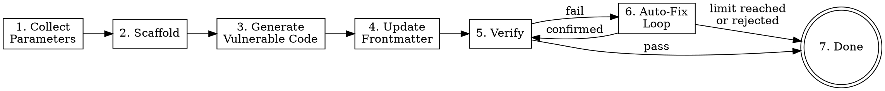

建立新的 wxl 題目 —— 從蒐集參數、scaffold、產生漏洞程式碼、更新 frontmatter 到 verify 與 auto-fix。此技巧是 host-agent-neutral：只用 Claude Code / Codex CLI / Gemini CLI 三家共有的工具（`Bash`、`Read`、`Write`、`Edit`、`Glob`、`Grep`、`WebFetch`），透過 plain-text 問句區塊與使用者互動。

**Input**：`/wxl-creator` 後面的引數是選填的題目描述，例如：

- `/wxl-creator`（無引數 —— 全程互動式提問）
- `/wxl-creator 建一個 flask 的 SQLi 題目叫 login-bypass`
- `/wxl-creator name: xss-form, backend: fastapi, vuln: reflected XSS, difficulty: medium`

**Workflow overview：**



---

**Steps**

1. **蒐集參數（Collect parameters）**

   先掃描使用者初始訊息（`/wxl-creator` 後面的引數），抓出已提供的參數。要蒐集的參數如下：

   | 參數 | Key | 必填 | 預設 |
   |-----|-----|------|------|
   | 題目名稱（slug） | `slug` | 是 | — |
   | Backend 類型 | `backend` | 是 | — |
   | 漏洞類型 | `vuln` | 是 | — |
   | 題目描述 | `description` | 是 | — |
   | 難度 | `difficulty` | 是 | — |
   | Flag | `flag` | 否 | `FLAG{<slug>_<random8hex>}` |
   | Title | `title` | 否 | slug 轉 Title Case |

   每個尚未提供的參數，發出一個 plain-text 問句區塊、等使用者下一則訊息回覆。問句以 round 為單位 —— 一個 round 內所有參數都已抓到就跳過整 round。

   **Plain-text 問句區塊格式**（每 round 一塊）：

   ```
   📋 Round <N> — <topic>:
     1) <option-A>
     2) <option-B>
     3) <option-C>
   Please reply with a number, the option name, or a custom value.
   ```

   **Round 1（必填）：**
   - slug：問題目名稱（自由文字）。驗證：必須是 kebab-case（`/^[a-z0-9]([a-z0-9-]*[a-z0-9])?$/`）；不合法就解釋原因並再問。
   - backend：plain-text 問句區塊，選項 `1) flask  2) fastapi  3) php`。
   - vuln：自由文字（SQLi、XSS、SSRF、LFI、RCE、XXE、SSTI、IDOR 等）。

   **Round 2（內容）：**
   - description：請使用者描述 scenario，作為產生漏洞程式碼的依據。
   - difficulty：plain-text 問句區塊，選項 `1) easy  2) medium  3) hard`。

   **Round 3（可選，有預設值）：**
   - flag：顯示預設格式 `FLAG{<slug>_<random8hex>}`，問是否要客製化；接受預設就稍後自動產生。
   - title：顯示預設值（slug 轉 Title Case），問是否要客製化。

   蒐集完所有參數後，顯示摘要：

   ```
   📋 Challenge 參數確認：
     Name:       <slug>
     Backend:    <backend>
     Vuln Type:  <vuln>
     Difficulty: <difficulty>
     Flag:       <flag or "auto-generate">
     Title:      <title>
     Description: <description>
   ```

   然後發出 plain-text 確認區塊：

   ```
   📋 確認建立？
     1) 確認
     2) 修改參數
   Please reply with `1` (confirm) or `2` (modify).
   ```

   等使用者下一則訊息。若回覆 `2`（或 "modify"），重新詢問該參數。

2. **Scaffold**

   透過 Bash 跑 scaffold 指令：

   ```bash
   pnpm create:challenge --name "<slug>" --backend "<backend>" --difficulty "<difficulty>" --flag "<flag>" --title "<title>"
   ```

   若 `flag` 為 auto-generate，省略 `--flag`（scripts 自己會產）。

   **exit code = 0**：回報成功、進到 step 3。

   **exit code = 1（名稱衝突）**：顯示錯誤訊息、發出 plain-text 問句區塊：

   ```
   📋 名稱衝突：
     1) 選擇不同名稱
     2) 取消
   Please reply with `1` or `2`.
   ```

   等使用者回覆。`1` → 重問 slug、重跑 scaffold；`2` → 中止 workflow。

   **exit code = 1（其他錯誤）**：顯示錯誤後中止。

3. **產生漏洞程式碼（Generate vulnerable application code）**

   這是核心步驟。你必須讀 scaffold skeleton 後改寫成真正可 exploit 的漏洞程式碼。

   **3.0. 諮詢 capability-specific reference（如適用）。** 讀 skeleton 前，先把蒐集到的 `vuln` 比對下面的 capability registry table。若命中某個 trigger regex，先讀對應的 `reference/<capability>.md`，讓它的 recognition heuristics 與 per-primitive fix hints 引導你產生的漏洞。

   | Trigger regex | Reference file |
   |---------------|----------------|
   | `idor\|jwt\|path.?traversal\|access.?control\|broken.?access`（不分大小寫） | `reference/a01-access-control.md` |

   之後新增的 capability pack 只要在這張表 append 一 row 即可延伸此行為 —— 不需要改動本 workflow 的其他部分。

   a. 用 Read tool **讀 skeleton**：
      - Flask/FastAPI：`docs/challenge/<slug>/src/app.py`
      - PHP：`docs/challenge/<slug>/src/index.php`

   b. **讀 canonical reference —— 唯一指定路徑 `docs/challenge/door-is-open/`（不是要建立的 slug）** 作為程式碼風格 / 結構的**唯一**參考。你不可以加任何其他參考路徑。
      - `docs/challenge/door-is-open/src/app.py`

   c. 用 Write tool **覆蓋 skeleton 寫入漏洞程式碼**。產出的程式碼必須：
      - 沿用 reference 的結構（docstring、imports、setup、HTML template、routes）
      - 用 `open("/flag.txt").read().strip()` 讀 flag
      - 含**真正可 exploit** 的漏洞，且漏洞類型對應使用者指定
      - 不可過於明顯（避免裸 `eval(user_input)` 或 `os.system(input())`）
      - 含 HTML UI（form、頁面）營造真實攻擊面
      - 有清楚的 exploitation path 可拿到 flag
      - 在漏洞那行加註解：`# Vulnerability: <brief explanation>`

   d. 紀錄漏洞需要的 **package dependencies**（例如 SQLi 需 `sqlite3`）；步驟 4 會加進 frontmatter。

   **Backend-specific 指引：**
   - **Flask**：`from flask import Flask, request, Response`，routes 用 `@app.route()`。
   - **FastAPI**：`from fastapi import FastAPI`、`from fastapi.responses import HTMLResponse`，routes 用 `@app.get()` / `@app.post()`。
   - **PHP**：`<?php` 開頭；輸入用 `$_GET`/`$_POST`；flag 用 `file_get_contents('/flag.txt')`。

4. **更新 frontmatter 與描述（Update frontmatter and description）**

   用 Read tool 讀 `docs/challenge/<slug>/index.md`，再用 Edit tool 更新：

   a. **新增 / 更新 frontmatter 欄位：**
      - `description`：依使用者描述衍生的 1-2 句題目說明
      - `tags`：相關 tag 陣列 —— 含漏洞關鍵字與 backend（例如 `[sql, injection, flask, sqlite]`）
      - `source_visible: false`
      - `packages`：漏洞需要的 Python packages 陣列（例如 `[sqlite3]`），不需要就留 `[]`

   b. **替換 markdown body：** 把 `TODO: Write challenge description here.` 改成 1-2 句題目描述（scenario + 玩家目標）。

   **不可改動**：`title`、`layout`、`difficulty`、`category`、`backend`、`app`、`date` —— scaffold 已設正確。

5. **跑 analyze + validate**

   透過 Bash 依序跑兩個指令：

   ```bash
   pnpm challenge:analyze <slug>
   ```

   ```bash
   pnpm challenge:validate <slug>
   ```

   **兩者都 exit code 0 且 analyze 無 warning**：顯示成功訊息、跳到 step 7（成功完成）。

   **任一 fail（非 0 exit）或 analyze 有 warning**：顯示完整輸出、進入 step 6（auto-fix loop）。

6. **Auto-fix loop**

   ```dot
   digraph fixloop {
       node [shape=box];
       start [label="Parse errors/warnings", shape=ellipse];
       check_limit [label="attempts < max?", shape=diamond];
       fix [label="Propose fixes"];
       show_diff [label="Show changes\nto user"];
       confirm [label="User confirms?", shape=diamond];
       apply [label="Apply fixes"];
       revalidate [label="Re-run analyze\n+ validate"];
       pass [label="All pass?", shape=diamond];
       done [label="→ Step 7\n(success)", shape=doublecircle];
       stop_limit [label="→ Step 7\n(with errors)"];
       stop_reject [label="→ Step 7\n(with errors)"];

       start -> check_limit;
       check_limit -> fix [label="yes"];
       check_limit -> stop_limit [label="no"];
       fix -> show_diff;
       show_diff -> confirm;
       confirm -> apply [label="yes"];
       confirm -> stop_reject [label="no"];
       apply -> revalidate;
       revalidate -> pass;
       pass -> done [label="yes"];
       pass -> start [label="no"];
   }
   ```

   **讀 config**：本步驟一開始用 Read tool 讀 `.wxl-creator/config.yaml`，解析 YAML 抓 `max_fix_attempts`；檔案不存在或沒這欄位就用預設值 **10**。`attempt = 0` 初始化。

   **每輪：**

   a. `attempt += 1`。若 `attempt > max_fix_attempts`，顯示：

      ```
      已達到自動修正上限（<max> 次）。以下問題需要手動處理：
      - <remaining errors/warnings>
      可在 .wxl-creator/config.yaml 調整 max_fix_attempts。
      ```

      跳到 step 7（伴錯誤完成）。

   b. **Parse** 上一輪 analyze / validate 的錯誤輸出，列出所有 issue。

   c. **Propose fixes** —— 一次處理所有 issue：
      - 缺 / 無效 frontmatter 欄位 → 用 Edit tool 補正
      - backend 對應檔案類型錯 → 修正
      - flag 不符合 `FLAG{...}` 或 `CTF{...}` → 重寫 flag.txt
      - app 程式碼裡 hardcode `localhost`/`127.0.0.1`/`0.0.0.0` → 移除或替換
      - 缺檔 → 用 Write tool 建檔
      - 若失敗 challenge 的 `tags` 與某個已註冊 capability 的 taxonomy 相交（見 step 3.0 registry table），提修補前先諮詢該 capability 的 `reference/<capability>.md` 「Per-primitive fix hints」節。A01 —— tags 與 `idor`、`access-control`、`jwt`、`path-traversal`、`broken-access` 相交 —— 讀 `reference/a01-access-control.md`。

   d. **套用前**，對使用者描述所有將要改動的內容、解釋原因。

   e. 發出 plain-text 確認區塊：

      ```
      📋 套用這些修正？
        1) 套用
        2) 跳過，顯示剩餘錯誤
      Please reply `apply` / `skip` (or `1` / `2`).
      ```

      等使用者下一則訊息再套用。

   f. **使用者確認**（`1` / `apply`）：用 Edit / Write tool 套用所有 fix，然後重跑：

      ```bash
      pnpm challenge:analyze <slug>
      pnpm challenge:validate <slug>
      ```

      兩者都 pass → step 7（成功）；否則 → loop 回 (a)。

   g. **使用者回 `skip`（`2`）**：顯示剩餘錯誤、跳到 step 7（伴錯誤完成）。

7. **完成（Completion）**

   **成功（所有檢查都過）：**

   ```
   ✓ Challenge "<slug>" 建立完成！

   檔案結構：
     docs/challenge/<slug>/index.md
     docs/challenge/<slug>/src/<app-file>
     docs/challenge/<slug>/src/flag.txt

   Analyze: ✓ 通過
   Validate: ✓ 通過

   可使用 pnpm docs:dev 預覽，或繼續建立下一個題目。
   ```

   **失敗（仍有未處理錯誤）：**

   ```
   ⚠ Challenge "<slug>" 已建立但有未解決的問題：
   <list remaining errors/warnings>

   請手動修正後執行：
     pnpm challenge:validate <slug>
     pnpm challenge:analyze <slug>
   ```

---

**Guardrails**

- 不可跳步，依序執行 workflow。
- 不可產生過於明顯的漏洞（裸 `eval()`、`os.system(input())` 等）。
- 一定要先讀 scaffold skeleton 再覆寫 —— 不可在沒看過 skeleton 結構的情況下憑空寫程式碼。
- 一定要把 `docs/challenge/door-is-open/src/app.py` 當作程式碼風格的 canonical reference 來讀過再產出。不可 fallback 到 `.archive/`、不可 fallback 到 `docs/challenge/` 下其他目錄、不可吃使用者傳入的路徑、不可自動發現「next available demo」。canonical reference 不可讀就停 scaffold，並輸出含字面路徑 `docs/challenge/door-is-open/` 的錯誤訊息。
- 不可改既有 scripts（`create-challenge.ts`、`challenge-validate.ts`、`challenge-analyze.ts`）—— 直接呼叫。
- 一定要等使用者回覆 plain-text 確認區塊後才套用 auto-fix。
- 一定要追蹤 fix loop counter，遵守 `max_fix_attempts`。
- 不可在本技巧內使用任何 host-agent-specific 原語。問句區塊一律 plain text；不要呼叫任何平台專屬的問句 / plan-mode / task-tracking 原語。

**Quick Reference**

| Command | 用途 |
|---------|------|
| `pnpm create:challenge --name <slug> --backend <type>` | Scaffold + keygen |
| `pnpm challenge:analyze <slug>` | 內容分析 + warning |
| `pnpm challenge:validate <slug>` | 結構 + frontmatter 驗證 |

| Backend | App File | Language |
|---------|----------|----------|
| flask | `app.py` | Python |
| fastapi | `app.py` | Python |
| php | `index.php` | PHP |

**常見錯誤（Common Mistakes to Avoid）**

- 忘記在 frontmatter 設 `source_visible: false`
- Flag 不符合 `FLAG{...}` 或 `CTF{...}` 規範
- app 程式碼裡 hardcode `localhost` / `127.0.0.1` —— app 跑在 WASM、不是真實 server
- 漏洞需要額外 package 時忘記寫進 frontmatter 的 `packages`
- 跳過 auto-fix 套用前的確認區塊
