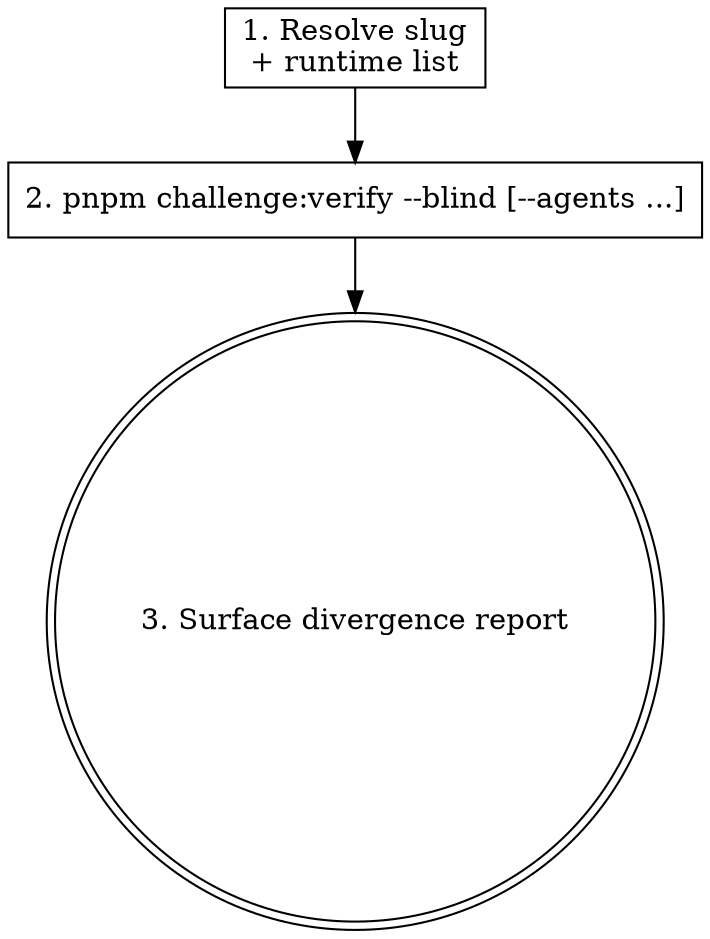

Run the L4 blind-solve cross-check for a challenge by delegating to the existing `pnpm challenge:verify --blind` CLI, optionally against several agent runtimes in one go. This skill is a thin, maintainer-only wrapper: all orchestration, verdict aggregation, and divergence reporting are owned by the `l4-multi-agent-cross-check` capability's CLI contract. It is host-agent-neutral and depends only on `Bash`, `Read`, `Write`, `Edit`, `Glob`, `Grep`, `WebFetch`.

**Input**: The argument after the trigger is the challenge `slug`, optionally with a runtime list (e.g. `door-is-open` or `door-is-open claude,codex,gemini`).

## Overview

`wxl-crosscheck` owns the **L4 cross-check** verb, and only maintainers use it — before a release, to surface cross-agent divergence (a key signal for difficulty calibration, cross-agent skill neutrality, and suspected non-intended solutions). It is **not run in CI** and requires the target runtimes' CLIs installed locally. It never runs the L1–L3 gate (that is `wxl-verify`) and never reimplements the multi-runtime orchestration (that lives in the CLI).

## Workflow



### Step 1: Resolve the slug and runtime list

- **What**: Establish the target `slug` and which runtimes to run (default `claude`).
- **How**: If the slug is not obvious, emit a plain-text question block. Precedence for the runtime list: `--agents` > list-form `WXL_VERIFY_RUNTIME` > default `[claude]`. See `reference/runtime-cli.md` for the full dispatch table, precedence rules, and per-runtime CLI argv contracts.
- **Verification**: A concrete slug and a resolved runtime list are known.

### Step 2: Invoke the L4 blind gate

- **What**: Run the blind cross-check via the existing CLI.
- **How**: Run via Bash. Single runtime:

  ```bash
  pnpm challenge:verify <slug> --blind
  ```

  Multiple runtimes (the three-runtime sweep has a shortcut):

  ```bash
  pnpm challenge:verify <slug> --blind --agents claude,codex,gemini
  # Shortcut for the same sweep:
  pnpm challenge:verify:cross <slug>
  ```

  Notes: `--agents` requires `--blind` (supplying `--agents` without `--blind` exits non-zero). Each runtime runs in its own ephemeral workdir (`tmp/wxl-verify/<slug>/<runtime>/`); the legacy single-runtime path keeps `tmp/wxl-verify/<slug>/` byte-for-byte. Add `--json` for machine-readable output containing `perAgent[]` and `aggregate { verdict, divergent }`.
- **Verification**: The command runs and returns an aggregate verdict, or a runtime-CLI error is surfaced (see Step 3).

### Step 3: Surface the divergence report

- **What**: Report the cross-agent outcome without fabricating a pass.
- **How**: Display the always-emitted cross-agent divergence report and the aggregate verdict (precedence: **fail > pass > inconclusive**). A single runtime emitting a non-canonical flag (suspected non-intended solve) fails the whole run. If one or more requested runtime CLIs are not installed locally and their runs cannot complete, surface the CLI error and explain that L4 requires the runtimes installed locally and is not run in CI — do NOT report a passing verdict.
- **Verification**: The user sees the per-agent outcomes, the aggregate verdict, and the divergence report (or a clear "runtime CLI unavailable" explanation).

## Anti-patterns

- ❌ **Treating L4 as part of the normal create/verify flow.**
  - ✅ L4 is maintainer-only, pre-release, not in CI; day-to-day authoring uses `wxl-create` → `wxl-verify` (L1–L3).
  - **Why**: L4 spawns real agent runtimes and is expensive; it is a calibration signal, not a gate.
- ❌ **Passing `--agents` without `--blind`.**
  - ✅ `--agents` only applies to L4; always pair it with `--blind`.
  - **Why**: The CLI exits non-zero otherwise.
- ❌ **Reporting a pass when a runtime CLI is missing.**
  - ✅ Surface the CLI error and explain the local-install requirement.
  - **Why**: A fabricated pass hides that the challenge was never actually cross-checked.

## Verification

- `pnpm challenge:verify <slug> --blind [--agents ...]` runs and its aggregate verdict + divergence report are surfaced (Requirement "Skill invokes the L4 blind multi-agent cross-check").
- Host-agent-neutral prose (inherited from `authoring-skill-pattern`):

  ```bash
  git grep -nE '<FORBIDDEN-PATTERN>' .agent/skills/wxl-crosscheck/
  # <FORBIDDEN-PATTERN> = the forbidden-primitive regex from openspec/specs/authoring-skill-pattern/spec.md; exit code 1 = pass
  ```
