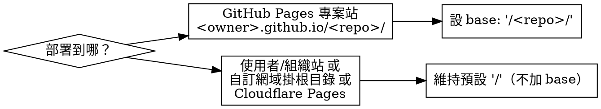

# WXL Fork 最小改動清單（fork-init）

## Overview

把本 repo（`wxl-template`）fork／template-clone 成自己的專案時，**要動的檔案其實很少**——這是一份「最小改動清單」。照著 Workflow 跑，就能得到一個身分乾淨、可自建部署、授權合規的新專案。

核心區分兩種意圖，工作量差很多：

- **A. 沿用 WXL 品牌**（只是拿 template 加自己的題目）→ 只需 Workflow 的 Step 1–6，約 10 分鐘。
- **B. 改名成全新產品**（rebrand）→ Step 1–6 之外，還要做「附錄：rebrand 額外工作」的全庫 `wxl` rename pass（約 485 處 / 50 檔）。

何時**不適用**：只是在既有 repo 內開發、或只想改幾個字串——那不需要本 skill，直接編輯即可。

> ⚠️ fork **不會**繼承 upstream 的 branch protection ruleset；新 repo 的保護規則要自己重設。

### 前置需求（不論 A/B）

新環境要能 `pnpm build`，需要：

| 工具 | 版本／取得 |
|---|---|
| Node.js | ≥ 18（CI 用 22／24） |
| pnpm | `packageManager` 已釘 `pnpm@10.28.0`，用 corepack 即可 |
| Rust toolchain | rustup（`wasm:build` 需要） |
| wasm-pack | `cargo install wasm-pack` |
| binaryen | `wasm-opt` 用；CI 走 `apt-get install -y binaryen` |

## Workflow

### Step 1：`package.json` 身分欄位

| 欄位 | 現值 | fork 後 |
|---|---|---|
| `name` | `"wxl"` | 你的套件名（B 才需改；A 想保留品牌可不動） |
| `version` | `"1.0.0"` | 建議重設為 `"0.1.0"`（新專案從頭計版） |
| `author` | `"CXPh03n1x"` | 改成你自己；見 Step 5 的 attribution 義務 |
| `repository.url` / `bugs.url` / `homepage` | `BrowserLaboratory/wxl-template` | 換成你的新 repo（三欄都要） |
| `license` | `"LicenseRef-LICENSE"` | 沿用授權可保留，或填 SPDX id `"ECL-2.0"`（見 Step 5） |

`description`（`"Web eXploitation Laboratory — ..."`）屬品牌敘述，B 才需改。

### Step 2：VitePress `base`（GitHub Pages 最常見的雷）

`.vitepress/config.mts` **目前沒有 `base:`**，等於預設 `/`。是否要加，看部署位置：



漏設 `base` 的症狀：頁面能開，但 CSS／JS／WASM 全部 404（asset 路徑錯）。

同檔另兩處身分：`title:`（第 35 行）與兩處 `socialLinks` 的 GitHub link。A 可只改 socialLinks；B 連 title 一起改。

### Step 3：對外 GitHub URL

把指向 upstream 的連結換成你的新 repo：

- `README.md`：Quick Start 的 clone URL 與 `cd` 目錄。
- `CONTRIBUTE.md`：clone／`upstream` remote／Reporting issues 三處。
- （`package.json` 三欄已在 Step 1 涵蓋。）

### Step 4：部署 workflow（本 repo 未內建）

`.github/workflows/` 只有 `quality-gates.yml` 與 `release.yml`，**沒有 pages 部署**。本 skill 附了現成範本：

```bash
cp .agent/skills/wxl-fork-init/deploy.yml.template .github/workflows/deploy.yml
```

範本用 GitHub 官方 `upload-pages-artifact` + `deploy-pages`，並已裝好 Rust／wasm-pack／binaryen。用前先確認 Step 2 的 `base` 已依部署位置設好。
Cloudflare Pages 走 dashboard 設定即可（build command 見 `README.md`「Deploying to Cloudflare Pages」），base 維持 `/`。

### Step 5：授權（ECL-2.0）合規

`LICENSE` 是 **ECL-2.0**（Educational Community License 2.0，Apache-2.0 家族＋教育機構專利條款，OSI 認可、可自由 fork／改作）。義務：

- **保留 `LICENSE` 檔**（及若有的 `NOTICE`）與既有著作權／歸屬標示。
- 若把 `package.json.author` 改成自己，建議在 `README` 保留 upstream 出處標示（Apache 家族的 attribution 要求）。
- 有實質修改時，於顯著處註明你做了變更。
- 想在 `package.json.license` 用標準 SPDX，可填 `"ECL-2.0"`。

### Step 6（選配）：release 資產名

`.github/workflows/release.yml` 會打包 `wxl-${tag}.zip`。B（rebrand）才需把 `wxl-` 前綴換成新名；A 可不動。

### 附錄：B（rebrand）額外工作

若要改成全新產品名，`wxl` 短名（= **W**eb e**X**ploitation **L**aboratory）散落約 **485 處 / 50 檔**（`git grep -won wxl`，已排除 `openspec/changes/archive/**` 與 lockfile）。屬機械式改名，但有幾處是 **runtime 敏感鍵**，改了等於換 storage key／env 名，務必一次改齊並理解影響：

| 類型 | 位置 | 備註 |
|---|---|---|
| localStorage key | `wxl-locale`（`.vitepress/theme/i18n/index.ts`） | 改了＝既有使用者的語系偏好被重置 |
| 環境變數 | `WXL_VERIFY_RUNTIME`（challenge-verify 流程） | 改名要同步文件與 scripts |
| 暫存工作目錄 | `tmp/wxl-verify`（`scripts/challenge-verify-blind.ts`） | 純本機路徑 |
| release 資產 | `wxl-${tag}.zip`（`release.yml`） | 見 Step 6 |
| 站台標題／品牌 | `title:`（vitepress）、`description`（package.json）、README 文案 | 對外可見文字 |

建議 B 開一支獨立 branch 做，先 `git grep -lw wxl` 列清單、分類（程式識別碼 vs 對外文案 vs runtime 鍵）再逐類替換，避免 storage/env 鍵被誤傷。

## Anti-patterns

- **只改 socialLinks 忘了 `base`** → 部署後整站 404。GitHub Pages 專案站一定要做 Step 2。
- **`git push` 到受保護的 main 被擋** → 那是 upstream ruleset 需經 PR，不是 fork 問題；新 repo 若沒設 ruleset 就不會擋。
- **CI 綠但 Pages build 失敗** → 多半是部署 workflow 少裝 Rust/wasm-pack/binaryen；用 Step 4 範本即可。
- **沿用授權卻刪了 `LICENSE`／原始 attribution** → 違反 ECL-2.0，見 Step 5。
- **rebrand 時只用 `sed` 全域取代 `wxl`** → 會誤傷 localStorage／env／IndexedDB 鍵；務必先分類（見附錄）。

## Verification

改完後確認沒有殘留 upstream 身分（archive 為歷史快照，刻意排除）：

```bash
git grep -n "BrowserLaboratory/wxl-template" -- . ':(exclude)openspec/changes/archive/**'
git grep -nE "CXPh03n1x|CXPhoenix" -- . ':(exclude)openspec/changes/archive/**'
```

兩條預期在 fork 完成後皆回傳你自己的身分或零殘留（`package.json.author` 若刻意保留 upstream attribution 則例外）。

本機能建置＋預覽：

```bash
pnpm install && pnpm build && pnpm docs:preview
```

預期：build 綠、`.vitepress/dist/` 產出、預覽站 asset 不 404（若 404 → 回頭檢查 Step 2 的 `base`）。
