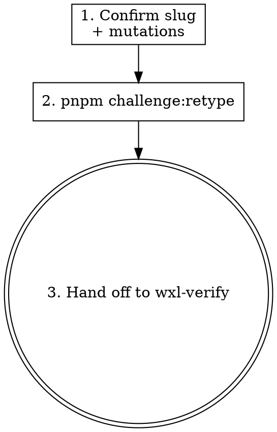

Mutate an existing wxl challenge's metadata — `backend`, `difficulty`, `tags`, or `category` — through the `pnpm challenge:retype` CLI, then hand off to `wxl-verify` to confirm the change did not break the challenge. This skill is host-agent-neutral: it depends only on `Bash`, `Read`, `Write`, `Edit`, `Glob`, `Grep`, `WebFetch`, and asks questions through plain-text blocks.

**Input**: The argument after the trigger names the target `slug` and the mutation(s), e.g. `door-is-open backend=flask` or `door-is-open difficulty=hard tags=idor,access-control,fastapi`.

## Overview

`wxl-mutate` owns the **Mutate** verb only. It is invoked when the user asks to change an existing challenge's `backend`, `difficulty`, `tags`, or `category`, or says "mutate / retype / 改 backend / 改難度 / 改 tags / change category" while referencing a slug. It never creates challenges (that is `wxl-create`) and never edits `index.md` frontmatter or renames `src/app.py` / `src/index.php` by hand — the CLI is the only mutation entry point.

## Workflow



### Step 1: Confirm the target and mutations

- **What**: Establish the target `slug` and which of `backend` / `difficulty` / `tags` / `category` change.
- **How**: If the slug is not obvious, emit a plain-text question block and wait for the reply.
- **Verification**: A concrete slug and at least one mutation flag are known.

### Step 2: Run challenge:retype

- **What**: Apply the mutation through the only supported entry point.
- **How**: Build and run via Bash, using only these flags: `--backend`, `--difficulty`, `--tags`, `--category`. Pass tags as a comma-separated string.

  ```bash
  pnpm challenge:retype <slug> [--backend <b>] [--difficulty <d>] [--tags '<t1,t2>'] [--category <c>]
  ```

  Inspect the exit code:
  - **0** → mutation succeeded; go to Step 3.
  - **1** → user input error (unknown slug or invalid flag value). Surface stderr and stop.
  - **2** (`manual retype required`) → the script could not preserve the vuln body automatically (typically a cross-language backend swap such as `python` ↔ `php`). Surface the reason verbatim, explain a manual rewrite is required, and abort without retrying.
  - **3** → internal error (IO / keygen). Surface stderr; the maintainer needs to debug.
- **Verification**: `pnpm challenge:retype` exited 0 (or the non-zero case was surfaced and the stage aborted as specified). Skill prose did not edit frontmatter or rename source files directly.

### Step 3: Hand off to wxl-verify

- **What**: Confirm the mutation did not break the challenge.
- **How**: Run `pnpm challenge:verify <slug>` following the `wxl-verify` skill. If verify fails, offer to start the `wxl-verify` auto-fix loop the same way a fresh Create flow would.
- **Verification**: `pnpm challenge:verify <slug>` exits 0, or `wxl-verify` surfaces the remaining issues.

## Anti-patterns

- ❌ **Editing `index.md` frontmatter or renaming `src/app.py` / `src/index.php` by hand.**
  - ✅ Use `pnpm challenge:retype` exclusively; it is the only mutation entry point.
  - **Why**: Hand edits skip keygen and spec-sync, leaving the challenge inconsistent.
- ❌ **Retrying after exit code 2.**
  - ✅ Surface the `manual retype required` reason and abort; a cross-language swap needs a manual rewrite.
  - **Why**: The script cannot auto-preserve the vuln body across language families.
- ❌ **Chaining straight into the auto-fix loop.**
  - ✅ The Mutate stage is invocation-only; if verify fails, ask before starting the fix loop.

## Verification

- `pnpm challenge:retype <slug> ...` exits 0, then `pnpm challenge:verify <slug>` exits 0 (Requirement "Skill supports the mutate stage via challenge:retype").
- Host-agent-neutral prose (inherited from `authoring-skill-pattern`):

  ```bash
  git grep -nE '<FORBIDDEN-PATTERN>' .agent/skills/wxl-mutate/
  # <FORBIDDEN-PATTERN> = the forbidden-primitive regex from openspec/specs/authoring-skill-pattern/spec.md; exit code 1 = pass
  ```
