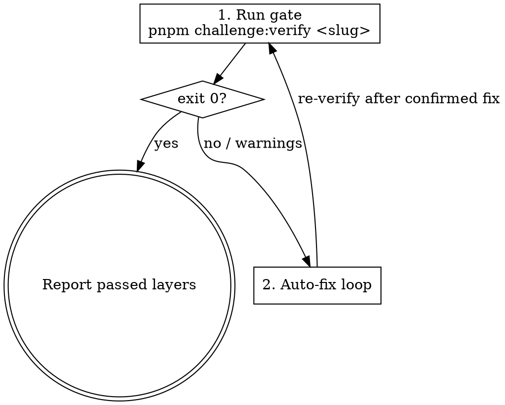
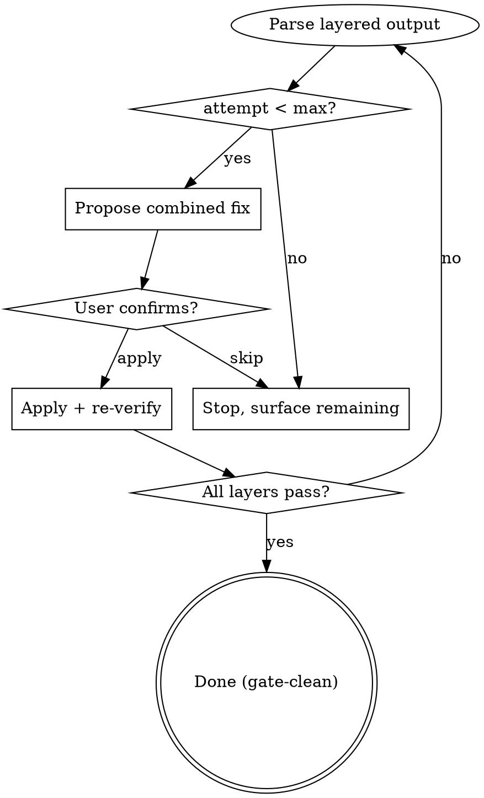

Run the layered `pnpm challenge:verify` gate for a challenge and, on failure, drive a bounded auto-fix loop with plain-text confirmation. This skill is the shared verification target that `wxl-create` and `wxl-mutate` hand off to, and it can be invoked directly after any manual edit. It is host-agent-neutral: it depends only on `Bash`, `Read`, `Write`, `Edit`, `Glob`, `Grep`, `WebFetch`, and confirms fixes through plain-text question blocks.

**Input**: The argument after the trigger is the challenge `slug` to verify (e.g. `door-is-open`).

## Overview

`wxl-verify` owns the **Verify** verb: it runs the release-blocking gate and repairs failures. The gate has three layers — L1 (frontmatter / structure lint), L2 (content analysis + keygen + `wasm-tools validate`), L3 (Playwright e2e exploit). L4 (blind solve) is NOT run here — it belongs to `wxl-crosscheck` and is maintainer-only.

The skill activates when the user asks to verify a challenge, or when `wxl-create` / `wxl-mutate` hand off after generating or mutating a challenge.

## Workflow



### Step 1: Run the layered gate

- **What**: Execute the release-blocking gate and display the per-layer result.
- **How**: Run via Bash:

  ```bash
  pnpm challenge:verify <slug>
  ```

  `challenge:verify` orchestrates L1 (delegates to the frontmatter/structure lint), L2 (content analysis + keygen + `wasm-tools validate`), and L3 (Playwright e2e). Never pass `--blind` from this skill.
- **Verification**:
  - Exit 0 → display a success message listing the layers that passed; the challenge is gate-clean; stop.
  - Exit 1 → display the layered output verbatim and go to Step 2.
  - Exit 0 with L1/L2 warnings in stdout (e.g. hardcoded localhost, flag-format mismatch) → display the warnings and go to Step 2.

### Step 2: Auto-fix loop



- **What**: Repair the failing layer(s) with the user's confirmation, then re-verify, until the gate is clean or the attempt limit is reached.
- **How — read the config first**: Read `.wxl-verify/config.yaml` and parse `max_fix_attempts`. If the file or field is absent, use the default **10**. Initialize `attempt = 0`.

  Each iteration:
  1. Increment `attempt`. If `attempt > max_fix_attempts`, display the remaining issues and stop, for example:

     ```
     已達到自動修正上限（<max> 次）。以下問題需要手動處理：
     - <remaining errors/warnings>
     可在 .wxl-verify/config.yaml 調整 max_fix_attempts。
     ```
  2. **Parse** the layered output; identify which layer failed (L1 / L2 / L3) and why; address all issues in one combined fix.
  3. **Propose fixes** (all issues at once):
     - Missing/invalid frontmatter fields → add/correct via Edit.
     - Wrong file type for backend → fix the mismatch.
     - Flag not matching `FLAG{...}` / `CTF{...}` → rewrite `flag.txt`.
     - Hardcoded `localhost` / `127.0.0.1` / `0.0.0.0` in app code → remove/replace.
     - Missing files → create via Write.
     - L3 spec assertion failure → revise `docs/challenge/<slug>/src/<app>` so the exploit returns the flag; do NOT edit `tests/challenges/<slug>.spec.ts`.
     - If the failing challenge's `tags` intersect a registered capability pack's taxonomy, read that pack's reference doc and consult its `Per-primitive fix hints` section before proposing the fix. For A01 (tags intersecting `idor`, `access-control`, `jwt`, `path-traversal`, `broken-access`), read `.agent/skills/wxl-create/reference/a01-access-control.md`.
  4. **Describe** all proposed changes (diff form) to the user, then emit a plain-text confirmation block:

     ```
     📋 套用這些修正？
       1) 套用
       2) 跳過，顯示剩餘錯誤
     Please reply `apply` / `skip` (or `1` / `2`).
     ```

     Wait for the user's next message before applying.
  5. **On `apply`**: apply fixes, then re-run `pnpm challenge:verify <slug>`. Exit 0 → done. Otherwise loop back to (1).
  6. **On `skip`**: display remaining errors and stop.
- **Verification**: The gate exits 0, or the loop stops within `max_fix_attempts` with the remaining issues surfaced. The confirmation is always plain text — never a host-specific question primitive.

## Anti-patterns

- ❌ **Running `--blind` (L4) from this skill.**
  - ✅ `wxl-verify` runs L1–L3 only; L4 is `wxl-crosscheck`, maintainer-only.
  - **Why**: L4 requires runtime CLIs installed locally, is not run in CI, and is a distinct maintainer concern.
- ❌ **Editing the Playwright spec to make L3 pass.**
  - ✅ Fix the app code so the exploit returns the flag; leave `tests/challenges/<slug>.spec.ts` untouched.
  - **Why**: The spec is the contract; editing it to pass hides a broken challenge.
- ❌ **Applying fixes without the plain-text confirmation.**
  - ✅ Always emit the `apply` / `skip` block and wait for the user's reply.
  - **Why**: Silent auto-edits surprise the author and can compound a wrong fix.
- ❌ **Looping forever.**
  - ✅ Respect `max_fix_attempts` from `.wxl-verify/config.yaml` (default 10).

## Verification

- `pnpm challenge:verify <slug>` exits 0 after the loop, or stops within the configured limit (Requirements "Skill runs the layered challenge:verify gate", "Skill auto-fixes validation errors with plain-text confirmation", "Fix loop has a configurable maximum iteration limit").
- Config honored: with `.wxl-verify/config.yaml` set to `max_fix_attempts: 5`, the loop stops after 5 attempts; with no file, it uses 10.
- Host-agent-neutral prose (inherited from `authoring-skill-pattern`):

  ```bash
  git grep -nE '<FORBIDDEN-PATTERN>' .agent/skills/wxl-verify/
  # <FORBIDDEN-PATTERN> = the forbidden-primitive regex from openspec/specs/authoring-skill-pattern/spec.md; exit code 1 = pass
  ```
